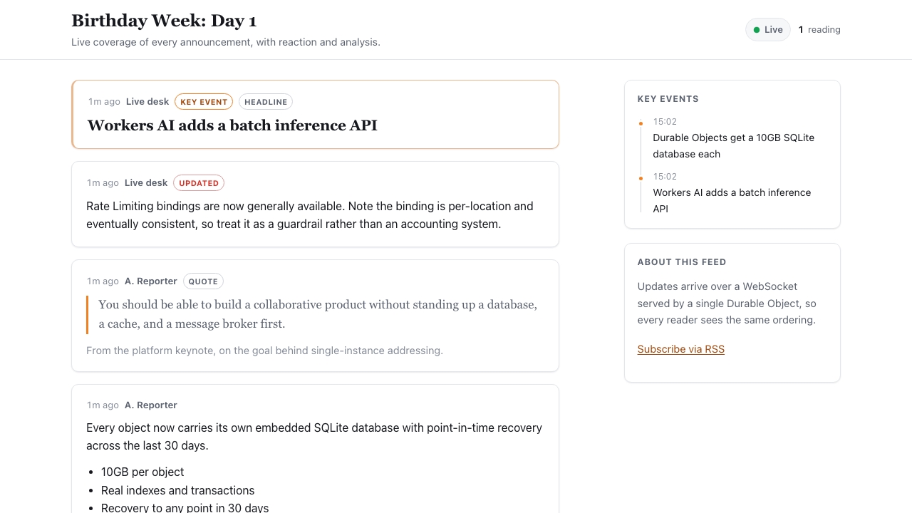
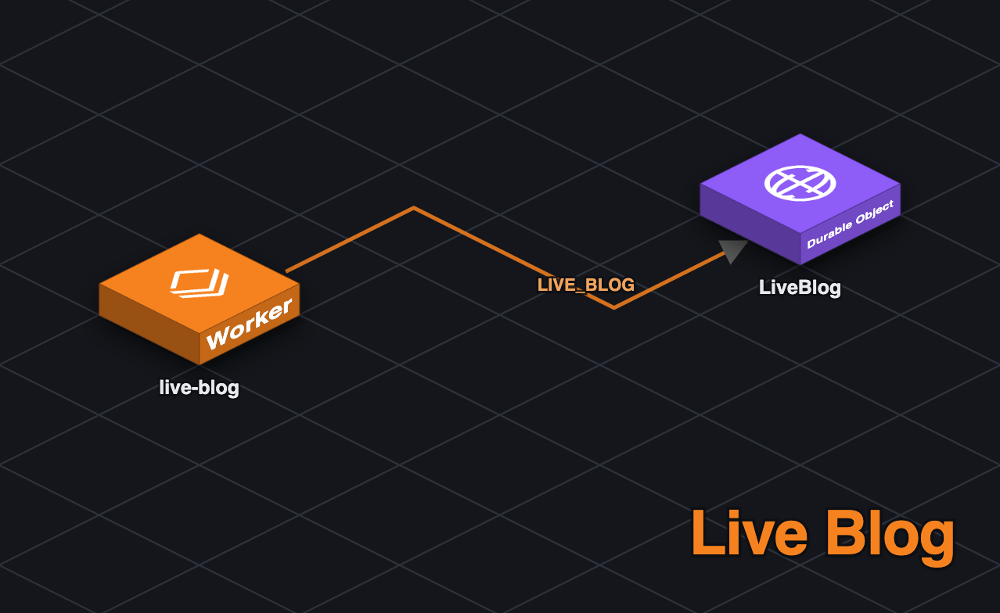
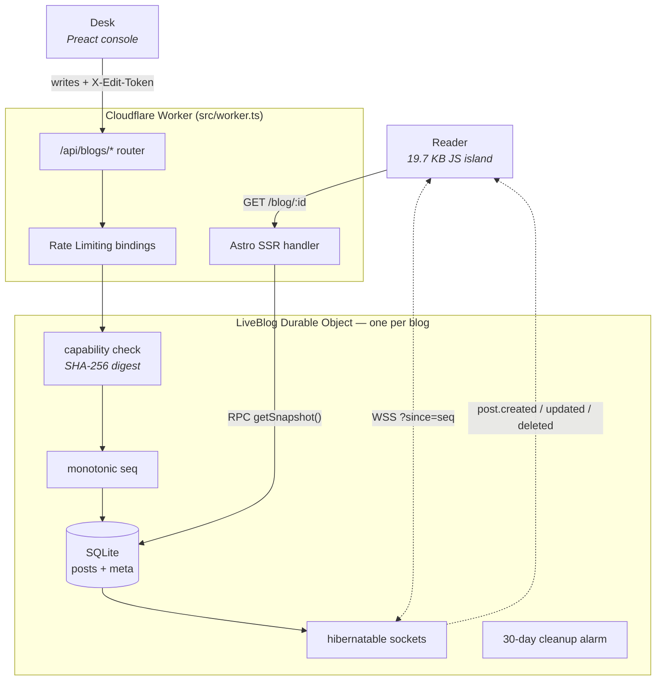

# Live Blog

[](https://deploy.workers.cloudflare.com/?url=https://github.com/Gryczka/cloudflare-live-blog)

A newsroom-style live blog on Cloudflare Workers. One SQLite-backed Durable Object
per blog orders every update, fans it out over hibernatable WebSockets, and serves
the feed as server-rendered HTML — so the reader downloads **19.7 KB of JavaScript**
and sees the content in the first HTML byte.

**[Live demo →](https://cloudflare-live-blog.dwarven.workers.dev)**



---

## What this is

A live blog is the news-industry format where a desk publishes short, timestamped
updates during an unfolding event, and readers watch them arrive without reloading.
It is a good demonstration case for Durable Objects because it needs three things
that are usually three separate pieces of infrastructure:

| Need | Usual solution | Here |
|---|---|---|
| Total ordering of updates | A database sequence or a single writer | An `AUTOINCREMENT` column, because writes are serialized by construction |
| Fan-out to many readers | Redis pub/sub, or a hosted realtime service | A loop over `ctx.getWebSockets()` |
| Read-after-write for the author | Careful cache invalidation | Free — the reader and the writer are the same object |

`idFromName(blogId)` is deterministic and global, so every author and reader of a
given blog is routed to the same instance no matter where they are. That single
property is what collapses the three rows above into one primitive.

This is a rebuild of [`Gryczka/live-blog`](https://github.com/Gryczka/live-blog), an
earlier Next.js version. The [Rebuild notes](#rebuild-notes) section is specific
about what was wrong with it, because the interesting content is in the diff.

## Features

**For readers**
- Feed rendered on the server, so it is present without JavaScript
- Live updates, edits, and removals over one WebSocket
- Concurrent reader count
- A "key events" rail of pinned updates
- Per-post permalinks, an RSS feed, and social card metadata
- Relative timestamps that tick, `aria-live` announcements, and a "N new posts" pill
  that never yanks the page out from under you
- Corrections are shown as an **Updated** badge; removals leave a visible tombstone

**For the desk**
- Capability-link authoring — no accounts, no login form
- Post types: update, headline, quote, image, embed
- Markdown, with a live preview identical to what readers get
- Edit, remove, and pin published posts
- Editable headline and standfirst; an explicit "coverage ended" state

## Architecture





Two things are load-bearing and easy to miss.

**The Astro page reads the Durable Object over RPC, not HTTP.** `getSnapshot()` is
called directly from page frontmatter, so rendering the feed does not involve a
second request into our own Worker.

**The WebSocket upgrade never reaches Astro.** `/api/blogs/*` is answered in
`src/worker.ts` before the framework is consulted, because a 101 response carrying a
`webSocket` property cannot survive a framework render pipeline — or, for that
matter, being copied to add headers. (`new Response(body, { status: 101 })` throws:
the constructor only accepts 200–599.)

## Reader payload budget

The reason this project was rebuilt. Both deployments were seeded with the same six
posts and measured in the same headless Chrome run, counting what the browser
actually requested:

| | Previous version (Next.js + OpenNext) | This version (Astro islands) |
|---|---|---|
| Script requests | 6 | **2** |
| JavaScript, uncompressed | 364,237 B | **20,200 B** |
| JavaScript, gzipped | 107,736 B | **7,038 B** |
| Posts in the server HTML | 0 | **6** |
| Largest Contentful Paint | 1,056 ms | **480 ms** |
| What gates first paint | JS download → hydrate → `fetch` → paint | nothing; the HTML contains the feed |

A methodology note, because the first number is easy to overstate. The previous
version's HTML also references a 112,594 B `polyfills` chunk, which would put the
total at 476,831 B — but it is marked `noModule`, so a current browser skips it. The
364,237 B figure above is what a modern browser really downloads, and is the fair
comparison. Counting every `<script src>` in the markup is not.

The LCP figures are the softer half of this table: both pages are fast in absolute
terms, and a single measurement over the public internet is noisy. The structural
claim underneath it is the durable one — 0 versus 6 posts in the server HTML means
the previous version could not paint content until JavaScript had booted, hydrated,
and completed a fetch, no matter how fast the network was.

A UI framework does appear in this project — Preact powers the author console — but
only on `/blog/:id/author`, which readers never request. The reader's island is plain
TypeScript. `scripts/check-bundle-budget.mjs` enforces both the byte budget and the
rule that Preact must not leak into a reader chunk, and it runs in CI, because this
is exactly the kind of regression that reintroduces itself quietly.

## Two sequences, deliberately

Each post row carries two numbers, and conflating them would break something:

- **`created_seq`** is assigned once and never changes. It orders the feed, so
  correcting a two-hour-old post does not shove it back to the top.
- **`seq`** is bumped on *every* mutation. It is the resume cursor.

That second one makes the reconnect protocol a single query. A client stores the
highest `seq` it has applied and reconnects with `?since=N`; the server runs
`WHERE seq > ? ORDER BY seq` and gets creations, edits, **and** deletions in one
result set — deletions included because they are soft, leaving a tombstone row whose
`seq` moved. Past `MAX_REPLAY_POSTS` the server sends `resync` instead, so one tab
left open overnight cannot ask the object to serialize an unbounded set.

## Authorization

There is no user model. Creating a blog mints a 256-bit token, returns it exactly
once, and stores only its SHA-256 digest — so reading this object's storage does not
grant the ability to publish. There is a test that asserts precisely that.

The token travels in the URL **fragment**:

```
https://example.workers.dev/blog/birthday-week-live/author#edit=EXAMPLE_TOKEN_NOT_A_REAL_KEY
```

Fragments are never transmitted to servers, so the token stays out of access logs,
`Referer` headers, and analytics beacons. The trade-off is explicit: the author page
cannot be authorized server-side, so it renders a public shell and the island
presents the key. Every write is authorized inside the Durable Object with a
constant-time digest comparison.

## Guardrails, in two layers

Public demos get abused, and the two mechanisms here are not interchangeable:

**Rate Limiting bindings** at the Worker edge reject junk cheaply. Writes are keyed
on the token's digest rather than an IP — a token identifies one author, whereas an
IP can be a whole office. This layer is per-Cloudflare-location and eventually
consistent, so it cannot enforce a total.

**SQL counts** inside the Durable Object are authoritative for anything that is a
total: posts per blog, pinned events, live connections.

A 30-day inactivity alarm deletes idle blogs, so a public demo does not accumulate
storage forever.

| Limit | Value | Enforced by |
|---|---|---|
| Post body | 4,000 chars | DO |
| Byline | 80 chars | DO |
| Title / standfirst | 140 / 280 chars | DO |
| Posts per blog | 5,000 | DO (`COUNT`) |
| Pinned key events | 12 | DO (`COUNT`) |
| Concurrent readers per blog | 1,000 | DO (`getWebSockets()`) |
| Writes | 30 / min / token | Rate Limiting binding |
| Blog creation | 5 / min / IP | Rate Limiting binding |
| Idle blog retention | 30 days | DO alarm |

These numbers are internally consistent, which is worth stating because the previous
version's were not: it advertised 1,000 posts per blog while storing the whole list
in a single key-value entry with a 128 KB ceiling, so it broke at roughly a dozen
full-length posts. Here the worst case is about 20 MB against a 10 GB budget.

## Markdown without a sanitizer

`src/lib/markdown.ts` is ~180 lines and replaces DOMPurify. The previous version
imported `isomorphic-dompurify` **into the Durable Object** — which pulls jsdom into
a Worker under `nodejs_compat` — configured with `ALLOWED_TAGS: []`, i.e. "strip
every tag". Loading an HTML parser and a DOM implementation to perform text escaping
is the wrong tool.

The safety argument here is the order of operations:

1. Escape `& < > " '` across the whole input. After this step the string provably
   contains no markup.
2. Only then apply formatting, emitting tags from a closed set this module writes
   itself: `p br strong em code pre a ul ol li blockquote h3`.

Because step 1 removes all author-controlled markup and step 2 only adds literals,
there is no path for injected HTML to survive — no sanitizer to misconfigure and no
parser to disagree with the browser. The one place input reaches an attribute is
link `href`, which is checked against a protocol allowlist. Rendering happens once,
on write, so no markdown parser ships to readers.

`test/markdown.test.ts` asserts the closed tag set directly: it renders hostile input
and checks that the only tags in the output are ones this module produces.

## Content Security Policy

Astro's `security.csp` computes SHA-256 hashes for every script and style it bundles,
which is why the deployed policy needs neither `unsafe-inline` nor `unsafe-eval`:

```
default-src 'self'; img-src 'self' data:; font-src 'self'; connect-src 'self';
frame-ancestors 'none'; base-uri 'self'; form-action 'self'; object-src 'none';
script-src 'self' 'sha256-…' …
```

Two notes for anyone copying this:

- For on-demand rendered routes Astro sends CSP as a **response header**, not a
  `<meta>` tag (`cspDestination` defaults to `"header"` when a route is not
  prerendered). Do not go looking for the meta element.
- `connect-src 'self'` **does** permit a same-origin `wss://` socket. This is
  verified in a real browser, not assumed — see the note on Shiki in
  `astro.config.mjs` for the one thing that did have to be turned off.

The previous version shipped `'unsafe-eval'` and `'unsafe-inline'` in `script-src`,
with a code comment explaining that its dev server required them.

## Getting started

```bash
npm install
npm run dev          # http://localhost:4321
```

`astro dev` runs your server code in `workerd` via the Cloudflare Vite plugin, so the
Durable Object, SQLite, WebSockets, and Rate Limiting bindings are all real locally.
There is no mock API. This is worth calling out because the previous version had two
implementations of its API — a real one and a set of dev-mode stubs that returned
fabricated data and refused WebSocket upgrades — so `npm run dev` ran a different,
non-functional application.

```bash
npm test             # 83 tests in workerd via vitest-pool-workers
npm run check        # astro check + tsc for the test project
npm run preview      # production build under wrangler dev
npm run budget       # reader JS budget check
npm run deploy       # astro build && wrangler deploy
```

Deploying provisions nothing beyond the Worker itself: the Durable Object namespace
and both Rate Limiting bindings come from `wrangler.jsonc`.

## Project layout

```
src/
  worker.ts                  Worker entrypoint: /api/blogs/* router, DO export,
                             security headers, then hands off to Astro
  durable-objects/
    LiveBlog.ts              SQLite schema, RPC surface, sockets, alarm
  lib/
    protocol.ts              wire types shared by server, pages, and islands
    limits.ts                every limit, imported by both sides
    capability.ts            token mint / hash / constant-time verify
    markdown.ts              the ~180-line renderer described above
    escape.ts                split out so the reader island skips the renderer
    render-post.ts           post markup, used by SSR *and* the island
    blog-id.ts               route-parameter validation
    server/blog.ts           typed DO stub for Astro pages
  islands/
    live-feed.ts             the reader island (plain TypeScript)
    create-blog.ts           landing page
  components/author/
    AuthorConsole.tsx        the only Preact in the project
  pages/                     landing, reader, author, permalink, rss.xml
test/                        markdown, capability, and Durable Object behaviour
scripts/check-bundle-budget.mjs
```

`render-post.ts` deserves a note: server-rendered posts and socket-inserted posts
call the same function. When they were separate implementations they drifted, and a
post that arrived over the socket looked subtly different from one that arrived in
the HTML.

## Rebuild notes

Bugs in the previous version that this one fixes, beyond the storage and payload
issues already covered:

- **No authorization whatsoever.** Anyone who guessed a blog id could publish to it.
- **Rate limiting was decorative** — an in-memory `Map` in the Durable Object, wiped
  by every hibernation, bypassable by waiting.
- **Reconnect storms.** Closing the old socket let its `onclose` schedule a *second*
  reconnect while the replacement was still connecting; fixed 3 s delay, no jitter,
  no attempt cap, and unmounting left a timer that reconnected for a page you had
  already left.
- **Cross-blog state leakage.** The store was a module singleton with no blog key, so
  `/blog/a` → `/blog/b` showed a's posts under b.
- **Three full fetches per load** — on mount, again on socket open, and again after
  every publish — each pulling the entire unpaginated post list.
- **Hydration mismatch** from `typeof window !== 'undefined' && window.location.port === '3000'`
  evaluated inside JSX, which also used port-sniffing as an environment check.
- **`webSocketClose` re-closed the socket** with a code that may be reserved; 1005 and
  1006 throw.
- **Security checks that never ran** — `ENFORCE_ORIGIN_VALIDATION = false` with
  `https://your-production-domain.com` still in the allowlist.

Bugs found while building *this* version, both caught by tests rather than by luck:

- `storage.deleteAll()` in the cleanup alarm drops the tables but does not evict the
  instance, so every subsequent query on that live instance failed with
  `no such table` — a 500 where a 404 belonged. The schema is now recreated
  immediately after.
- Adding security headers to the WebSocket upgrade threw, because copying a Response
  to attach headers cannot preserve status 101 or the `webSocket` property.

## Known limitations

- **Reader count is per object, not per region.** It counts sockets on the one
  instance, which is the correct number, but a very popular blog concentrates all
  reader connections in one location. Sharding fan-out across a tree of objects is
  the standard answer and is not implemented here.
- **Presence is broadcast on every join and leave.** Fine at demo scale; a blog with
  heavy connection churn would want this coalesced behind an alarm.
- **The short `Cache-Control` on reader pages is not doing much on `workers.dev`,**
  which has no zone cache in front of it. The stale-tolerance reasoning (a stale page
  resumes from its embedded `seq`, so staleness is invisible) is sound, but on a
  custom domain you would want to confirm it empirically before relying on it.
- **No image uploads.** The `image` post type styles a caption; it does not accept a
  file. R2 plus a signed direct upload is the obvious next step.
- **`astro dev` does not apply CSP** — Vite injects unhashed scripts in dev. Verify
  policy changes with `npm run preview`.

## License

MIT — see [LICENSE](LICENSE).
